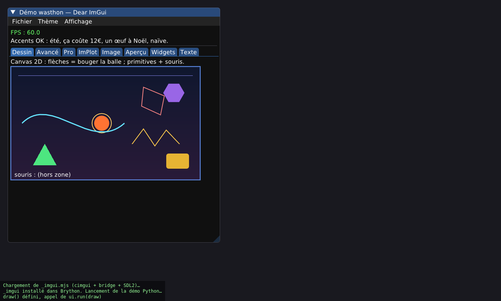

# wasthon GUI — Dear ImGui + ImPlot, pilotés en Python dans le navigateur

Un vrai GUI à widgets **piloté à 100 % en Python**, qui tourne **dans le navigateur**
en WebAssembly — sur **Brython + wasthon**, *pas* Pyodide.



```python
import _imgui as ui

def draw():                       # appelée à chaque frame (60 fps)
    ui.begin("Bonjour wasthon")
    ui.text("Dear ImGui piloté en Python !")
    changed, val = ui.slider_float("réglage", val, 0.0, 1.0)
    if ui.button("Clique"):
        ...
    ui.end()

ui.run(draw)                      # démarre la boucle de rendu
```

## Ce que c'est

`_imgui` est une **extension C CPython** (glue `_imgui.c`) compilée en WASM et chargée
dans Brython via le **bridge C-API de wasthon**. Elle expose **~199 fonctions** de
[Dear ImGui](https://github.com/ocornut/imgui) et [ImPlot](https://github.com/epezent/implot)
à Python — widgets, conteneurs, dessin 2D, graphes, images, audio, docking — le tout
rendu par WebGL/SDL2 dans un `<canvas>`.

Au-delà du GUI, **c'est une démonstration des capacités du bridge wasthon** : chaque
brique prouve qu'on peut brancher du code natif arbitraire sur Python-dans-le-navigateur.

| Brique | Ce que ça prouve |
|---|---|
| **Dear ImGui** (via cimgui) | une grosse lib **C++** pilotée depuis Python, pur C, sans pybind11 |
| **ImPlot** (via cimplot) | une **2e** lib C++ branchée avec la même recette |
| **stb_image** | un **décodeur C** (PNG/JPEG) qui décode des `bytes` Python en WASM |
| **SDL_mixer** | un **sous-système audio** ; WAV synthétisé en Python, joué en C |
| **`run(draw)`** | callback **C → Python** chaque frame (`PyObject_CallObject`) |
| **`plot_line_callback`** | **réentrance profonde** : C rappelle une fonction Python par point de courbe |
| **`drag_point` / `drag_line`** | boucle **Python ↔ C bidirectionnelle** pilotée à la souris |
| **police DejaVu embarquée** | accents / œ / € rendus (`--embed-file`) |
| **docking** | branche docking d'ImGui — fenêtres dockables, zéro régression |

## Lancer la démo

```sh
cd loader
python3 -m http.server 8910 --bind 127.0.0.1
# http://127.0.0.1:8910/imgui-demo.html
```

La démo (`loader/imgui-demo.html`) a 8 onglets — **Dessin** (canvas 2D : bézier, ngon,
dégradés, balle pilotée au clavier), **Avancé** (combo custom, slider log, color picker
HSV, vsliders…), **Pro** (drag & drop, table colorée, audio, polices à taille variable),
**ImPlot** (courbe/barres/camembert/heatmap/histogramme + point draggable), **Image**
(texture générée + Wasthon.png décodé par stb_image), plus Aperçu / Widgets / Texte — et
les menus **Thème** (sombre/clair/classique) et **Affichage** (démo ImGui intégrée,
docking).

> Le canvas est plein navigateur et redimensionnable. Le son se teste à la souris (les
> navigateurs n'autorisent l'audio qu'après un clic).

## Construire depuis zéro

```sh
cd gui-poc
./build_binding.sh        # fetch cimgui (docking) + cimplot + stb + police,
                          # compile tout en WASM, link _imgui.mjs/.wasm -> loader/
```

Le script récupère les dépendances (toutes **gitignorées**, comme `external/`), les
compile avec l'emsdk vendored (`external/emsdk`, emcc 5.0.7) et produit
`loader/_imgui.{mjs,wasm}` (~2,6 Mo, police + audio inclus).

## Architecture

- **cimgui / cimplot** : API **C** auto-générée d'ImGui / ImPlot (`extern "C"`) — c'est
  ce qui neutralise le C++ et permet un binding **pur C** via le bridge. cimgui est pris
  sur la **branche docking** (même imgui 19280 + docking).
- **glue `_imgui.c`** : ~199 wrappers Python → cimgui/cimplot, **init multi-phase**
  (`PyModuleDef_Init` + `Py_mod_exec`, le chemin que le bridge supporte). Tous les args
  passés en `'O'` puis convertis à la main (le bridge n'implémente pas encore `'s'`/`'f'`).
  Les widgets mutants suivent la convention pyimgui : ils renvoient `(changed, value)`.
- **SDL2 + WebGL** : fournis par emscripten (`-sUSE_SDL=2`), pas un port wasthon ;
  partageables avec un futur pygame. Audio via `-sUSE_SDL_MIXER=2`.
- **boucle** : `run(draw)` fait `emscripten_set_main_loop(frame, 0, 0)` ; `frame()` pompe
  les events SDL, ouvre une frame ImGui, **appelle `draw()` en Python**, puis rend en GL.

**Recette réutilisable** : pour brancher une autre lib C/C++, on compile ses sources +
son binding C contre les mêmes en-têtes, on l'inclut dans la glue, et on expose des
wrappers. ImPlot a été ajouté exactement comme ça par-dessus ImGui.

## Portée — honnêtement

Couverture **complète des usages courants** d'ImGui + ImPlot, et une démo de chaque
grande capacité. Ce n'est **pas** « 100 % de l'API » : cimgui+cimplot exposent ~2400
fonctions (en comptant tous les overloads par type, l'API interne, les accesseurs de
structs) ; on en binde 199 — l'essentiel utile. Restent du niche non bindé : subplots /
colormaps / annotations ImPlot, l'API *paths* du draw-list, le list-clipper, l'accès
complet aux structs style/IO, le **multi-viewport** (impossible dans un navigateur — pas
de fenêtres OS).

## Fichiers

- `_imgui.c` — la glue (le binding).
- `build_binding.sh` — fetch + build complet.
- `../loader/imgui-demo.html` — la démo Python.
- `build.sh` / les clones `cimgui/` `cimplot/` `imgui/` `stb/` `assets/` `obj/` —
  fetchés/générés, **gitignorés**.
